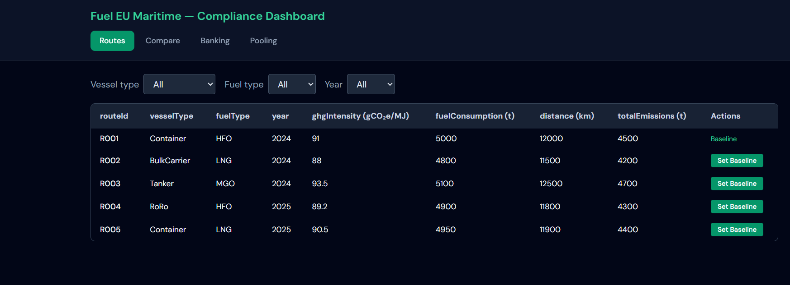
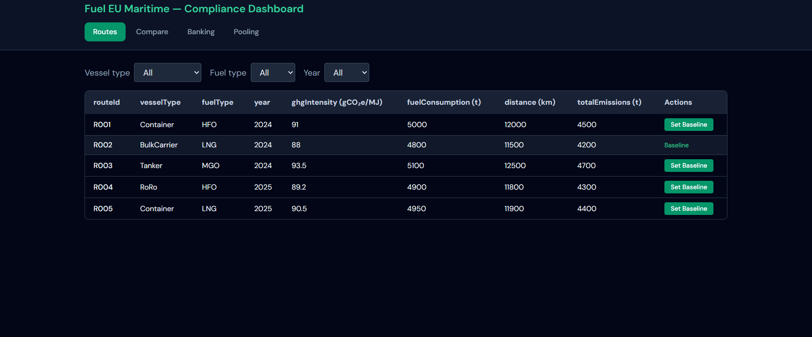
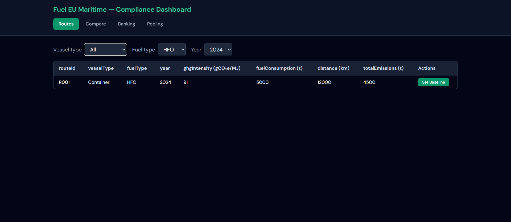
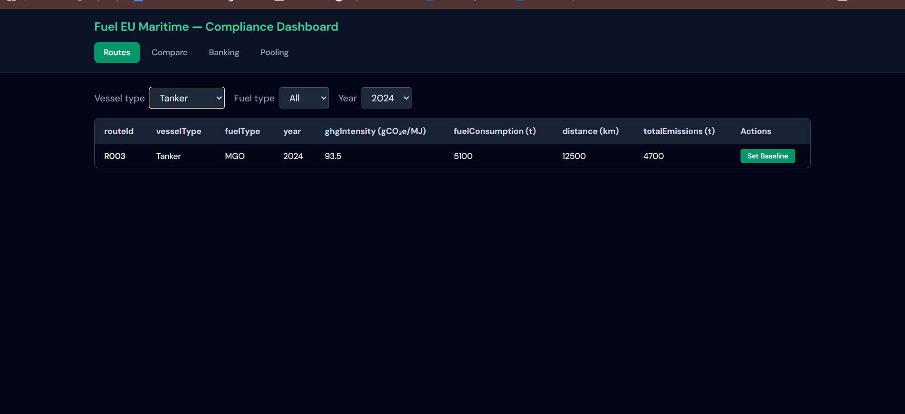
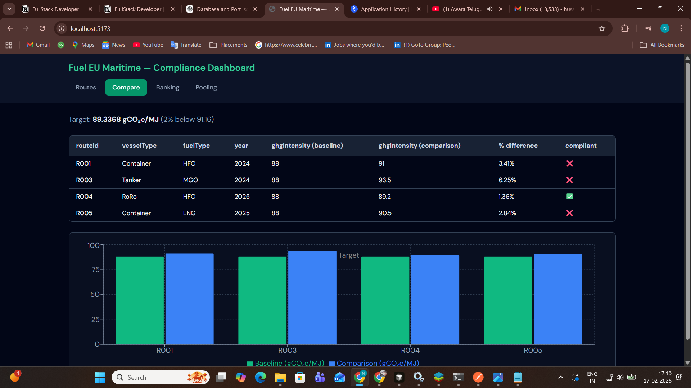
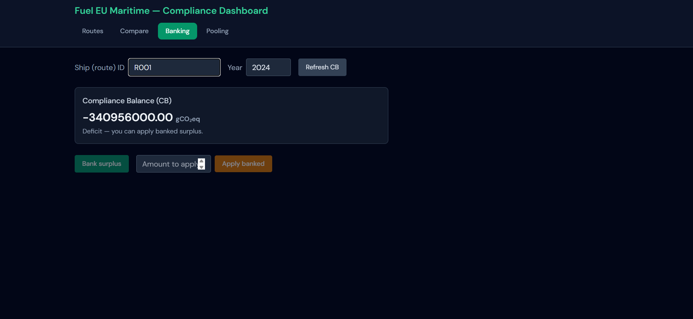
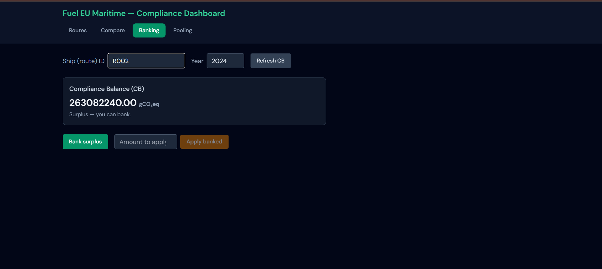
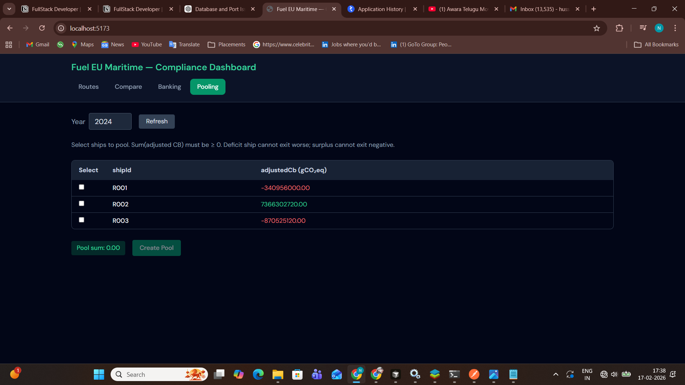
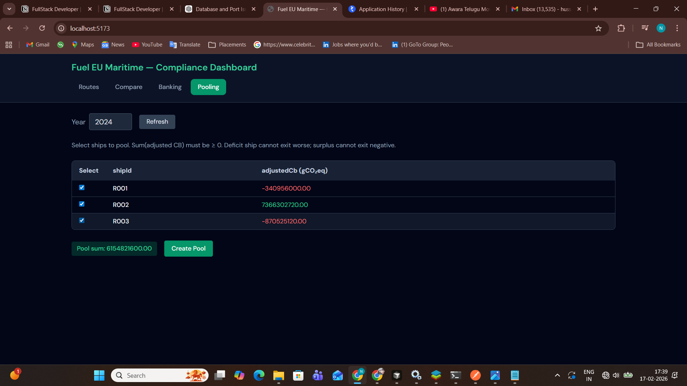

 Fuel EU Maritime — Compliance Platform

Minimal full-stack implementation of a Fuel EU Maritime compliance module: dashboard (React + TypeScript + TailwindCSS) and APIs (Node.js + TypeScript + PostgreSQL), following Hexagonal (Ports & Adapters) architecture.

Overview

- Backend: REST API for routes, baseline vs comparison, compliance balance (CB), banking (Article 20), and pooling (Article 21).
- Frontend:Four-tab dashboard — Routes, Compare, Banking, Pooling — with tables, filters, charts, and forms.
- Database: PostgreSQL with Prisma; tables: `routes`, `ship_compliance`, `bank_entries`, `pools`, `pool_members`.

 Architecture Summary (Hexagonal)

The backend is organised in a hexagonal (ports and adapters) way. The core holds only domain types, use cases and port interfaces: no Express, no Prisma, no database. Use cases depend on abstractions like RouteRepository and ComplianceRepository. The adapters implement those ports: the HTTP adapter handles Express routes and calls the use cases, and the Postgres adapter uses Prisma to read and write the database and maps rows to domain objects. The server file wires everything by creating the repositories and use cases and passing them into the handlers. So all “framework” details stay in adapters and infrastructure, and the core stays pure TypeScript and easy to test.

The frontend follows the same idea. The core has domain types and an ApiClient port. The UI adapters are the React tabs (Routes, Compare, Banking, Pooling) that call the API. The infrastructure adapter is the concrete API client that does fetch to the backend. So the tabs never import fetch directly; they use the client from the port. Styling is done with Tailwind and the shared constants (e.g. target intensity) live in a shared folder so both sides can stay in sync.

Setup & Run

### Prerequisites

- Node.js 18+
- PostgreSQL (e.g. local instance)
- Create DB and user (or use existing):

sql
CREATE USER fueleu_user WITH PASSWORD 'fueleu_pass';
CREATE DATABASE fueleu_db OWNER fueleu_user;

 Backend

Important: Run all commands from the project root (`task`), then `cd backend` (so `frontend` is not inside `backend`).

1. Create the PostgreSQL user and database (required; otherwise you’ll get “Authentication failed”):

-- In psql or pgAdmin, as a superuser:
CREATE USER fueleu_user WITH PASSWORD 'fueleu_pass';
CREATE DATABASE fueleu_db OWNER fueleu_user;

2. From project root:

cd backend
cp .env.example .env   # or use provided .env
Edit .env if your DB user/password/host/port differ
npm install
npx prisma generate
npx prisma db push
npm run db:seed
npm run dev

- API: `http://localhost:3001` (or the `PORT` in `.env`)

 Frontend

From the project root (not from inside `backend`):

cd frontend
npm install
npm run dev

- App: `http://localhost:5173` (Vite proxies `/api` to `http://localhost:3001`)
 Troubleshooting

 
Issue
What to Do
Authentication failed for fueleu_user
Create the PostgreSQL user and database, or update DATABASE_URL in backend/.env with correct credentials.
Port 3001 already in use
Stop the process using port 3001, or change the backend port in backend/.env (e.g., PORT=3002) and update the proxy target in frontend/vite.config.ts accordingly. On Windows: Get-NetTCPConnection -LocalPort 3001 | ForEach-Object { Stop-Process -Id $_.OwningProcess -Force }

EPERM on Prisma generate
Close any IDE or terminal using the backend folder, then run npx prisma generate again. If it still fails, run the terminal once as Administrator.
ECONNREFUSED when opening dashboard
Start the backend first (cd backend → npm run dev), then start the frontend. If using a different backend port, update the proxy target in frontend/vite.config.ts.

Pool creation returns 400 or wrong cb_after
Ensure total adjusted CB of selected ships is ≥ 0. If there are deficit ships, at least one surplus ship must offset them. The API enforces pooling validation rules.

---
 How to Execute Tests

### Backend

cd backend
npm run test

- Unit tests: `src/core/application/*.test.ts` (Jest + ts-jest).
- Integration: `src/infrastructure/server.test.ts` (Supertest).

### Frontend

cd frontend
npm run test

- Vitest; e.g. `api-client.test.ts`, `RoutesTab.test.tsx`.

 Screenshots / Sample Requests & Responses

The dashboard successfully fetches route data from the backend via the GET  http://localhost:3001/routes  and displays it in the Routes table.
The baseline status is retrieved from the database and reflected correctly, confirming API–database integration and state persistence AND  

R001 was baseline and remaining has buttons Set Baseline button to set particular route as base-line

When I click baseline on Route 2, it becomes highlighted and shows “Baseline” — is that correct  R002 was baseline and remaining has buttons Set Baseline button to set particular route as base-line
The Set Baseline action triggers the POST /routes/:routeId/baseline API, updating the selected 
route’s baseline flag in the backend.
The UI refresh confirms the API response is applied correctly, demonstrating full frontend–backend communication and update flow.

Vessel type ,Fuel type and year filters working.

Vessel type ,Fuel type and year filters working.

The Compare tab correctly uses the /routes/comparison API to fetch baseline and comparison route data.
Baseline GHG intensity is taken from the route marked as baseline in the backend database.
Comparison GHG intensity values are fetched for other routes of the same scope.
The percentage difference is calculated using the formula: ((comparison / baseline) − 1) × 100.
The compliance target is set to 89.3368 gCO₂e/MJ as defined in the FuelEU requirement.
A route is marked compliant if its comparison GHG intensity is less than or equal to the target.
The backend computes and returns percentDiff and compliant flags, ensuring consistent business logic.
The chart and table both reflect the same API response, confirming correct frontend–backend integration    Baseline GHG intensity = 88 gCO₂e/MJ (from baseline route selected via API).
Target GHG intensity = 89.3368 gCO₂e/MJ (FuelEU limit = 91.16 − 2%).
R001: Comparison = 91, PercentDiff = ((91 / 88) − 1) × 100 = 3.41%, Not compliant because 91 > 89.3368.
R003: Comparison = 93.5, PercentDiff = ((93.5 / 88) − 1) × 100 = 6.25%, Not compliant because 93.5 > 89.3368.
R004: Comparison = 89.2, PercentDiff = ((89.2 / 88) − 1) × 100 = 1.36%, Compliant because 89.2 ≤ 89.3368.
R005: Comparison = 90.5, PercentDiff = ((90.5 / 88) − 1) × 100 = 2.84%, Not compliant because 90.5 > 89.3368.
Compliance rule: If comparison GHG intensity ≤ 89.3368 → Compliant, otherwise → Not compliant.

Bank surplus and apply backend both disabled because bank did not contain any balance so bank surplus disabled and CB score is less than 0 so Apply Backend disabled

When cb score is greater than 0 bank surplus is enabled.

Before selecting ships:
The Create Pool button is disabled because no ships are selected and the Pool sum = 0.00, so pooling cannot be performed.
Pooling requires selecting ships whose combined adjusted CB is ≥ 0 to ensure compliance rules are met.

After selecting R001, R002, and R003:
The Create Pool button becomes enabled because ships are selected and the Pool sum = 6,154,821,600 gCO₂eq (positive).
This is valid since the surplus from R002 (+7,366,302,720) offsets deficits of R001 (−340,956,000) and R003 (−870,525,120), making total ≥ 0
 

